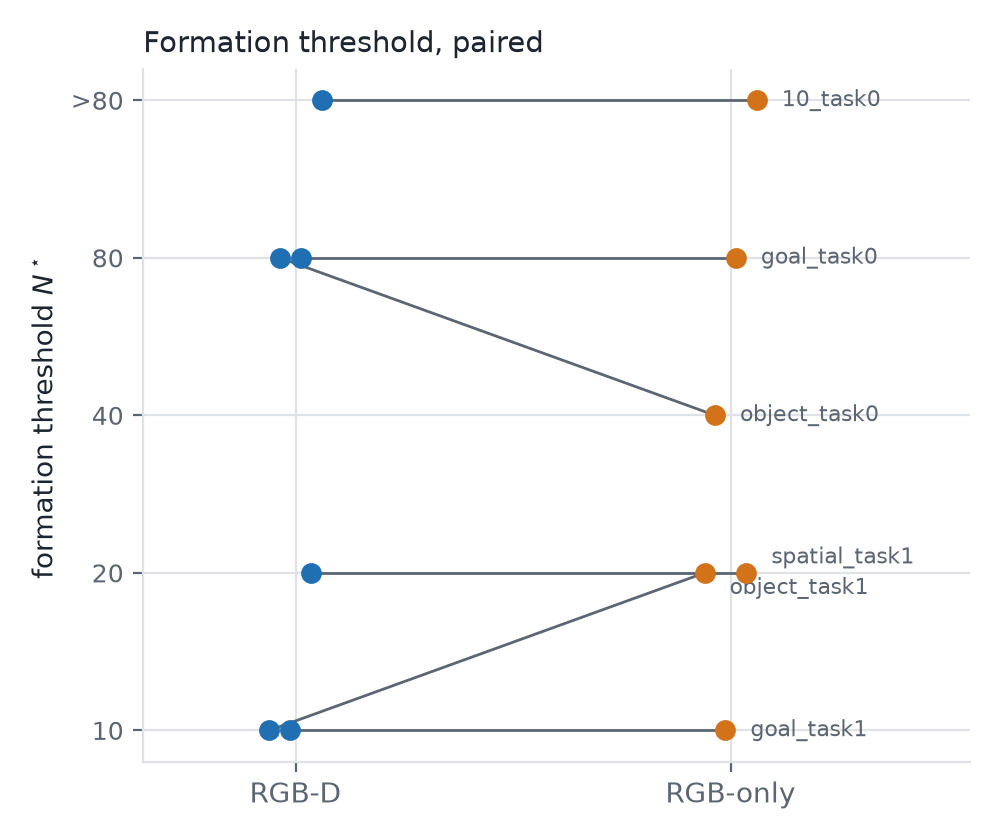
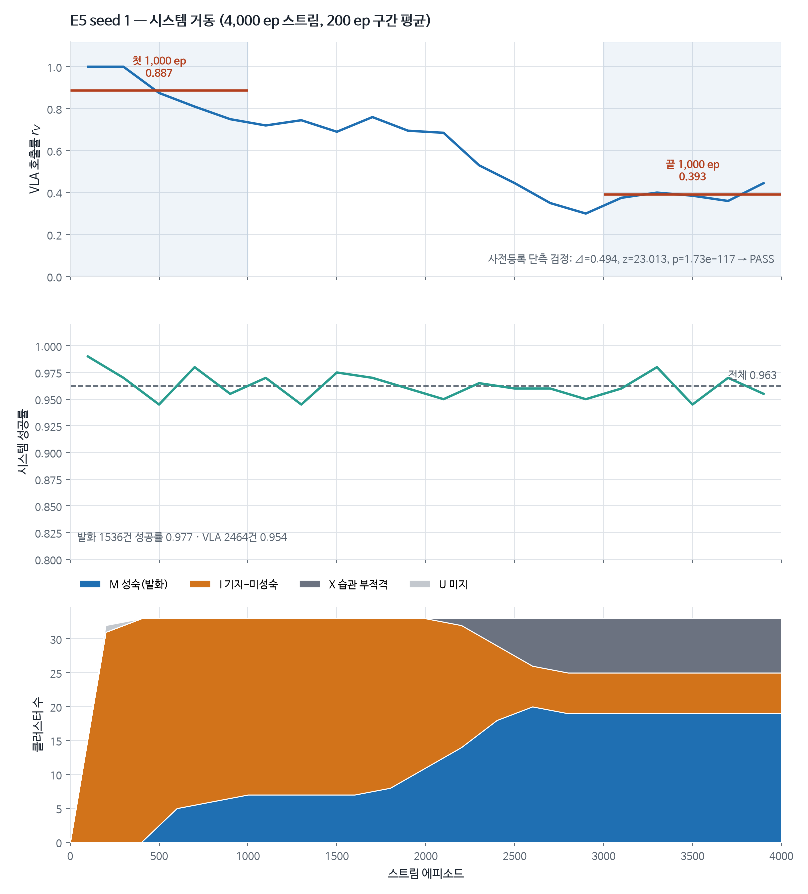
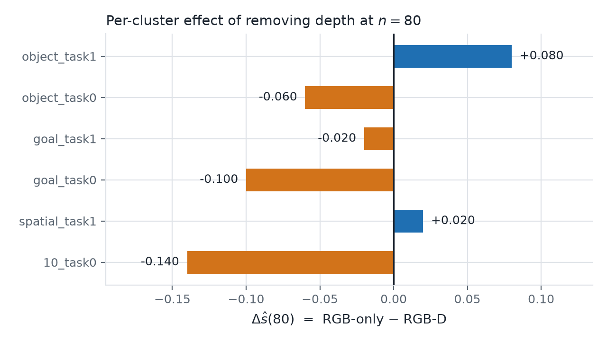

# HabitVLA-2 — 프로젝트 기록

> 이 문서는 저장소 전체를 한 번에 훑기 위한 서사다. 세부 수치의 원본은 `results/`의 JSON·CSV이고,
> 날짜별 원기록은 [`src/log.md`](src/log.md)다. 여기의 모든 값은 그 파일들에서 프로그래밍으로 주입했다
> (생성기 [`src/tools/make_project_story.py`](src/tools/make_project_story.py), 프로젝트 규칙 = 수치 수동 입력 금지).

**기간** 2026-08-15 ~ 2026-08-31 · **작업 기록** 49개 항목 · **번호 붙은 이슈** 15건 · **저장소** 코드 + 결과 + 판정 문서

## 한 문단 요약

로봇을 움직이는 대형 VLA 모델은 정확하지만 한 번 판단에 85.07 ms가 든다. 같은 상황을 반복해서 겪는 로봇이라면 매번 그 큰 모델을 불러야 할까 — 이것이 출발점이었다.

이 연구는 VLA가 성공한 궤적만 모아 상황 묶음마다 가벼운 습관 정책을 학습시키고, 그 습관을 믿어도 되는지 판정하는 2단 관문(익숙한 상황인가 · 충분히 검증됐는가)을 두어 VLA 호출을 선택적으로 생략한다. 습관 정책의 판단 비용은 3.36 ms로 VLA의 4.0% 수준이다.

결과는 3개 seed × 4,000 에피소드 온라인 스트림에서 VLA 호출 비율이 **0.874 → 0.405**로 떨어지는 동안 작업 성공률은 항상 VLA를 부른 경우 대비 **-0.0021**(허용 한계 -0.03)로 유지됐다는 것이다. 습관이 발화했을 때의 실패 확률은 0.0285로 상한 0.2 안에 있었다. 판정은 `3/3 seed 전 항목 PASS`.

동시에 **가설 하나는 데이터에 의해 기각됐고**, 게이트의 한 축은 **미해결로 확정**했다. 그 과정도 아래에 그대로 적었다.

## 1. 왜 시작했는가

**문제.** 시각-언어-행동(VLA) 모델은 로봇에게 범용성을 주지만 추론이 비싸다. 그런데 실제 배치된 로봇은 매번 새로운 상황을 만나지 않는다. 같은 부엌에서 같은 그릇을 반복해 옮긴다. 이미 수백 번 성공한 동작에까지 대형 모델의 full 추론을 지불하는 것은 낭비다.

**접근.** 출력값을 저장해 재사용하는 캐싱이 아니라, 반복 경험에서 **함수를 학습**하는 상각(amortization)이다. 에피소드 하나 안에서 토큰을 재사용하는 기존 연구와 층위가 다르다. 여기서는 에피소드들에 *걸쳐* 정책이 형성된다.

**검증할 가설 4개.** 각각 반증 조건을 미리 못 박고 시작했다 (전문 = [`src/CLAUDE.md`](src/CLAUDE.md) §2, 동결 수치 = [`src/configs/preregistration.md`](src/configs/preregistration.md)).

| 가설 | 내용 | 결과 |
|---|---|---|
| H1 형성 | VLA 성공 궤적만으로 상황별 경량 정책이 형성되는가 | **지지** |
| H2 이중 해리 | 의미 복잡도는 형성 *속도*를, 작업 길이는 도달 *천장*을 지배하는가 | **원가설 기각** → 경쟁 가설 채택 |
| H3 2단 게이트 | 익숙함 판정과 성숙도 판정의 결합이 각각 단독보다 안전한가 | **부분 · 저비용 익숙함 판정은 미해결** |
| H4 시스템 상각 | 온라인 스트림에서 호출률이 줄면서 성공률이 유지되는가 | **지지** |

## 2. 어떻게 진행했는가

단계마다 진행/중단 기준을 미리 정하고, 통과하지 못하면 다음으로 가지 않는 방식으로 운영했다.

### 2.1 기반 다지기

환경을 세우고 교사 모델의 실력을 먼저 실측했다. 4개 과제군 1000회 시행에서 성공률은 spatial 0.984 · object 0.984 · goal 0.996 · 10 0.968로, 공개 보고치와 맞았다 (`results/e1/e1_sv.json`). 비용 기준선도 같이 고정했다 — 교사 85.07 ms · 습관 정책 3.36 ms · 게이트 3.96 ms. 이 GPU에서는 flash-attn을 쓸 수 없어 attention 구현을 `sdpa`로 고정했고, 이후 모든 지연 수치에 이를 명기했다.

### 2.2 유일한 치명 관문

"성공 궤적만으로 정말 학습이 되는가" — 여기서 실패하면 연구 전체가 무의미해지는 단계였다. 판정은 `GO`였다 (`results/e2/e2_gonogo.json`). 궤적 수가 늘수록 성공률이 오르는 곡선이 나왔다.

### 2.3 규모 확대와 첫 좌절

27개 상황 묶음으로 확대해 각각의 성숙 곡선을 그렸다. 목표 성능에 도달하는 데 필요한 궤적 수의 중앙값은 20개였고, 끝까지 도달하지 못한 묶음이 1개 있었다 (`results/e3/e3_curves.json`).

이 단계에서 두 번 막혔다. 작업 두 개를 연달아 시키는 커스텀 환경이 스모크 테스트에서 계속 실패했는데, 원인을 파고든 끝에 **실행기 결함**을 찾아냈다. 정책이 한 번에 여러 행동을 내놓는 구조인데, 작업 단계가 중간에 바뀌면 남은 행동들이 낡은 판단인 채로 실행되고 있었다. 환경 문제로 보였던 것이 실은 우리 코드의 문제였다. 고친 뒤 회귀 테스트를 만들어 못 박았다 (`src/experiments/executor_chunkbreak_test.py`).

*상황 묶음마다 필요한 궤적 수. 대부분 10~20개에서 목표 성능에 도달하고, 긴 작업 하나가 끝까지 도달하지 못했다. 원자료 `results/e3/e3_curves.json`.*

### 2.4 가설이 깨진 자리

H2의 앞쪽 절반 — "의미가 복잡할수록 학습이 느려진다" — 는 **지지되지 않았다**. 의미 수준이 설명하는 분산은 전체의 2.5%에 불과했고 (Kruskal-Wallis p=0.772), 대신 **동작의 물리적 난이도**가 학습 속도를 설명했다 (`results/e3/h2_analysis.json`, 분석 상태 `FINAL`).

결과를 덮지 않고 경쟁 가설을 채택해 기록했다. 계층 구조가 의미 부담을 흡수했다는 해석을 함께 남겼다.

### 2.5 게이트의 절반은 풀리지 않았다

"지금 상황이 습관을 믿어도 될 만큼 익숙한가"를 값싸게 판정하려 했으나 실패했다. 기하적 특징 기반 판정기는 사전에 정한 기준을 넘지 못했고, 대형 모델의 내부 표현을 쓰면 성능은 나오지만 비용이 21배라 경량화라는 목적과 모순됐다.

> 기하 관할은 **표현 비용에 종속적**이며(히든 L32가 동일 셀에서 goal +0.1542 / 6셀 +0.089, 반면 집계만 바꾼 kNN은 goal +0.0241 / 6셀 -0.0118로 무효과 → 원인은 표현이지 집계가 아님), 그럼에도 21× 비용(85.07 vs 4.0ms)에도 임계 0.75 미달 → **저비용 실시간 관할은 미해결**.

**미해결을 미해결로 확정하고 다음 논문 과제로 넘겼다.** 성숙도 판정 단독으로도 위험 상한은 지켜졌기 때문에 시스템은 그대로 진행할 수 있었다.

### 2.6 통째로 버린 실행

온라인 스트림 실험의 첫 seed를 완주한 뒤 **정규화 결함**을 발견했다. 재학습마다 데이터 정규화 기준이 바뀌는데 이전 가중치를 이어받고 있어서, 모델이 서로 다른 좌표계를 가로지르고 있었다. 이미 나온 결과가 아깝더라도 **인용 금지로 못 박고 전량 폐기**했다. 관련 파일은 지우지 않고 `INVALID` 접두사를 붙여 증거로 남겼다.

재발을 막기 위해 재학습마다 세 가지를 런타임에 검사하도록 계약을 코드에 심었다 — 정규화 기준이 자기 학습 데이터에서 나왔는가, 학습량이 지정값과 같은가, 데이터 개수가 3중으로 일치하는가.

### 2.7 리뷰어의 의심을 스스로 검증하다

교사는 RGB만 보는데 습관 정책은 깊이 정보까지 받고 있었다. "습관이 잘하는 게 사실은 깊이 덕분 아니냐"는 반론이 가능한 구조였다. 먼저 6개 묶음으로 선별 검증했다 — 짝지은 비교에서 차이는 -0.015, 95% 신뢰구간 [-0.0392, 0.0092]로 0을 포함했고 McNemar 검정 p=0.2495였다 (`results/rgb_depth_ablation/ablation_summary.json`).

차이가 없다는 정황이었지만, 조건을 완전히 맞추기 위해 **깊이를 뺀 채 전체 프로토콜을 다시 돌렸다.** 무인 실행 약 70시간이 걸렸고, 도중에 감시 프로세스와 자동 재개 장치를 만들어 세션이 끊겨도 진행되게 했다.

## 3. 결과

### 3.1 시스템은 실제로 상각한다 (H4)

| 지표 | 값 (3 seed 평균±표준편차) | 판정 |
|---|---|---|
| VLA 호출 비율 (첫 1,000 → 끝 1,000 에피소드) | 0.874±0.0261 → 0.405±0.0442 | 3/3 통과 |
| 성공률 차이 (항상 VLA 대비, 허용 -0.03) | -0.0021±0.0015 | 3/3 통과 |
| 습관 발화 시 실패 확률 (상한 0.2) | 0.0285±0.0068 | 상한 내 |
| 성숙에 도달한 상황 묶음 | 20.3±2.1 / 33 | — |
| 성숙까지 필요한 노출 횟수 (중앙값) | 22.7±0.6 | — |

출처 `results/e5/seed_synthesis.json`. 짝지은 비교는 같은 초기 조건에서 교사를 다시 실행해 얻었다.

*seed 0의 스트림 4,000 에피소드. 습관이 성숙할수록 VLA 호출이 줄어드는 동안 성공률은 유지된다. 원자료 `results/e5/reading_0.json`.*

### 3.2 깊이 정보를 빼도 결론은 유지된다

교사와 습관의 입력을 맞춘 전체 재실행 결과다. 변경한 실험 변수는 깊이 제거 하나뿐이다.

| 지표 | 깊이 포함 | 깊이 제거 |
|---|---|---|
| VLA 호출 비율 (스트림 전체, 3 seed 평균) | 0.6152 | 0.5947 |
| 시스템 성공률 | 0.9608 | 0.9564 |
| 발화 시 실패 확률 | 0.0285 | 0.0377 |
| 습관 정책 판단 지연 | 3.35 ms | 3.35 ms |

사전 등록한 비열등 검정(스트림 전체 기준)은 **세 seed 모두 통과**했다 — 차이 -0.0065±0.0014, 허용 한계 -0.03의 약 1/5 수준이다.

다만 **습관이 실제로 발화한 구간만 따로 보면** 차이가 -0.0161±0.0036로 커지고, 모아 본 4863건에서 -0.016 (95% 구간 [-0.0224, -0.0097])로 부호가 일관되게 음수다. seed 하나는 이 구간 분석에서 신뢰구간 하한이 허용 한계를 아슬아슬하게 넘겼다. 사전 등록 기준으로는 통과지만 **습관과 교사 사이에 실재하는 격차**로 보고 한계에 적었다 (`results/rgb_only_full_rerun_20260828/05_paired_replay/PAIRED_REPLAY_SUMMARY.json`).

*묶음별 성능 차이(깊이 제거 − 깊이 포함). 신뢰구간이 0을 가로지른다. 원자료 `results/rgb_depth_ablation/ablation_summary.json`.*

**습관 정책의 판단 지연은 깊이 유무에 사실상 영향받지 않았다.** 비용 이점은 입력 양식이 아니라 모델 크기에서 온다.

### 3.3 결과를 믿을 수 있는 근거

- 무결성 감사: 검사 47건, 실패 0건 → `VALID`. 학습·평가 데이터 중첩 0, 중복·누락 에피소드 0, 미성숙 상태 발화 0, 체크포인트 전수 깊이 미사용 확인.
- 패키지 단독 재계산: 검사 52건, 실패 0건 → `PASS`. 저장소 코드를 불러오지 않고 원장 CSV만으로 요약값을 다시 계산해 대조했다.
- 릴리스 검증: 이 저장소만 clone해 빌드하고 저장된 결과를 재산출하는 절차를 통과했다 → [`results/VERIFICATION_REPORT.md`](results/VERIFICATION_REPORT.md).

## 4. 역할과 협업 방식

**실험 설계와 사전등록, 단계별 진행·중단 판정, 결과 해석, 폐기 결정은 내가 맡았다.** 코드 작성과 장시간 실행은 AI 코딩 도구(Claude Code)에 위임했고, 그 경계를 저장소에 명시해 두었다 ([`src/CLAUDE.md`](src/CLAUDE.md) §6 — 실행 · 판정 · 결정의 3자 분리).

판단이 필요했던 지점은 전부 내 결정이었다. 정규화 결함을 발견했을 때 완주한 seed를 폐기할지, 저비용 익숙함 판정을 비싼 대안으로 바꿀지 아니면 미해결로 확정할지, 깊이 정보 교락 의심에 70시간을 더 쓸지 — 어느 것도 자동으로 정해지지 않았다.

실행을 위임한 대신 **위임한 결과를 검증하는 장치를 설계에 넣었다.** 수치를 손으로 옮기지 못하게 하는 규칙, 재학습마다 런타임에 계약을 검사하는 단언, 산출물을 처음부터 재구성해 대조하는 무결성 감사가 그것이다. 이 저장소의 검증 기록은 그 장치들이 실제로 작동한 결과다.

## 5. 되짚어 볼 판단들

이력 관점에서 의미가 있는 것은 통과한 단계보다 막힌 자리에서 내린 선택이다.

1. **환경 탓으로 넘기지 않고 자기 코드를 의심했다.** 커스텀 환경의 반복 실패를 진단한 끝에 실행기가 낡은 행동을 버리지 않는 결함을 찾았다. 회귀 테스트로 못 박았다.
2. **완주한 실험을 스스로 폐기했다.** 정규화 결함을 발견하고 첫 seed 결과 전량을 인용 금지로 처리했다. 증거는 지우지 않고 `INVALID` 표시로 남겼다.
3. **가설이 깨진 것을 그대로 보고했다.** 의미 복잡도 가설이 지지되지 않자 경쟁 가설을 채택하고 그 근거를 기록했다.
4. **미해결을 미해결이라고 적었다.** 저비용 익숙함 판정이 기준에 미달하자 성능이 나오는 비싼 대안으로 갈아타지 않고, 한계로 확정한 뒤 다음 과제로 넘겼다.
5. **반론을 미리 검증했다.** 깊이 정보가 특권 정보라는 의심을 선별 검증으로 확인한 뒤, 정황에 만족하지 않고 70시간짜리 전체 재실행으로 조건을 맞췄다.
6. **수치를 손으로 옮기지 않는 규율을 유지했다.** 모든 표와 그림은 결과 JSON에서 프로그래밍으로 생성했다. 이 문서도 같은 방식으로 만들어졌다.

## 6. 한계와 남은 일

- **저비용 익숙함 판정이 미해결이다.** 기하 특징만으로는 기준 미달, 대형 모델 내부 표현은 비용 모순.
- **발화 구간의 격차가 일관되게 음수다.** 사전 등록한 허용 한계는 통과하지만 방향이 한쪽으로 쏠린다.
- **긴 작업(long-horizon)에서 형성이 완결되지 않았다.** 우측 절단된 묶음이 남아 있다.
- **시뮬레이션이다.** 성공 판정이 무료로 정확한 환경이며, 실물에서는 판정기 오차부터 측정해야 한다 → [`src/docs/REAL_ROBOT_PORTING_GUIDE.md`](src/docs/REAL_ROBOT_PORTING_GUIDE.md).
- **논문 본문은 이 저장소에 없다.** 집필용 자료와 수치 대조 지시서만 `results/reports/`에 있다.

## 7. 인용할 때 주의할 것

결과 폴더에는 **의도적으로 남겨둔 무효 산출물**이 있다. 성과로 인용하면 안 된다.

| 대상 | 이유 |
|---|---|
| `results/e5/seed0_normstats_invalid/`, `INVALID_*` | 정규화 결함으로 폐기한 최초 실행 |
| `results/e5/seed0_batchdata_invalid/` | 학습 데이터 출처 오류로 폐기 |
| `*_negative`, `smoke_run1_nocoverage` | 사전등록 위반 경로를 차단한 음성 결과 |
| 무효 실행 ↔ 재실행 수치 비교 | 두 변수가 동시에 바뀌어 효과 분리 불가 |
| `ineligible_postmortem_*` | 탐색적 분석 — 결과 절이 아니라 한계 논의에만 |

전체 규칙은 [`results/reports/20260821_manuscript_pack_MANUSCRIPT_SOURCES.md`](results/reports/20260821_manuscript_pack_MANUSCRIPT_SOURCES.md) 상단 표에 있다.

## 8. 더 깊이 보려면

| 알고 싶은 것 | 파일 |
|---|---|
| 날짜별 전 과정과 실패 기록 | [`src/log.md`](src/log.md) |
| 설계 의도와 가설 정의 | [`src/CLAUDE.md`](src/CLAUDE.md) |
| 실험 전 동결한 수치와 변경 이력 | [`src/configs/preregistration.md`](src/configs/preregistration.md) |
| 결과 수치와 그 출처 | [`results/README.md`](results/README.md) |
| 판정 요청·결과 보고 문서 | [`results/reports/`](results/reports/) |
| 습관 정책 학습 코드 | [`src/habits/`](src/habits/) |
| 2단 게이트 구현 | [`src/gates/two_stage.py`](src/gates/two_stage.py) |
| 온라인 스트림 드라이버 | [`src/experiments/e5_driver.py`](src/experiments/e5_driver.py) |
| 빌드와 재현 절차 | [`src/README.md`](src/README.md) |

## 9. 숫자로 본 규모

| 항목 | 값 |
|---|---|
| 기간 | 2026-08-15 ~ 2026-08-31 |
| 작업 기록 항목 | 49개 |
| 추적한 이슈 | 15건 |
| 상황 묶음 (형성 대상) | 27개 |
| 온라인 스트림 에피소드 | 12,000 (재실행분) + 동일 설계의 최초 실행 |
| 학습된 습관 정책 체크포인트 | 253개 (재실행분만) |
| 코드 파일 | 119개 |
| 무인 연속 실행 | 약 70시간 (재실행), 실패 job 0 |

---

*생성 2026-09-03 · 생성기 `src/tools/make_project_story.py` · 저장소 커밋 `043626e`*
